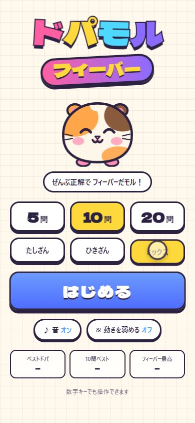
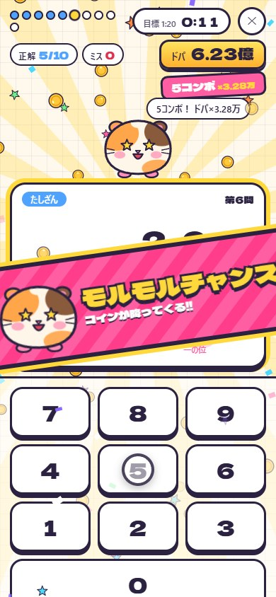
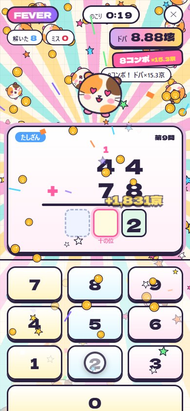

# ドパモルフィーバー

**正解するほど演出がどんどん派手になる、筆算ドリル。**
2桁のたし算・ひき算を一の位から解いていくと、マスコットのモルモット「ドパモル」が大よろこび。
連続正解でドパ（ポイント）が 万 → 億 → 兆 → 京 … とインフレし、全問ミスなしの 100点 でエクストラテスト（フィーバー）に挑戦できます。

<table>
  <tr>
    <td></td>
    <td></td>
    <td></td>
    <td></td>
  </tr>
  <tr>
    <td align="center">タイトル</td>
    <td align="center">コンボで演出アップ</td>
    <td align="center">100点で…</td>
    <td align="center">フィーバー!!</td>
  </tr>
</table>

- スマホ向け（PC でも遊べます）。ブラウザで開いて「ホーム画面に追加」するとアプリのように使えます
- 一度開けばオフラインでも遊べます
- 広告・アカウント・課金・データ送信なし。記録はその端末の中だけに保存します

---

## 遊び方

1. 問題数（5 / 10 / 20問）と種類（たしざん / ひきざん / ミックス）を選んで「はじめる」
2. 筆算の答えを **一の位から** 数字キーで入れる（くり上がり・くり下がりのメモも出ます）
3. 正解するとドパ獲得！ 連続正解（コンボ）で倍率がどんどん上がる
4. 全問ミスなしで 100点 を取ると **エクストラテスト**（30秒のフィーバー）に挑戦できる

## 演出の段階

| コンボ | 段階 | 演出 |
| --- | --- | --- |
| 0 | 0 | 星がはじける |
| 1〜2 | 1 | 紙吹雪 |
| 3〜4 | 2 | 「チャンス到来!!」、画面が揺れる、コインの噴水 |
| 5〜7 | 3 | カットイン「モルモルチャンス!!」、背景に光線、コインの雨、BGM が速くなる |
| 8〜 | 4 | カットイン「激アツ確定!!」、虹色の光線、虹色の文字 |
| フィーバー | 5 | 全部盛り。ミニドパモルが降ってくる、倍率が桁違い |

- ミスするとコンボが切れて段階が下がります
- 画面全体のフラッシュは 0.5 秒に1回までに抑えています（光の点滅で気分が悪くならないように）
- 「動きを弱める」をオンにすると、揺れ・フラッシュ・光線の回転を止め、パーティクルも減らします
- 効果音と BGM はすべてプログラムで合成しています（音声ファイルなし）

---

## ローカルで動かす

[Node.js](https://nodejs.org/)（v20 以上、推奨 v22）が必要です。

```bash
npm install
```

```bash
npm run dev
```

表示された URL を開きます。スマホで試すときは `npm run dev -- --host` で起動し、`Network:` の URL をスマホで開いてください。

### ビルド・公開

```bash
npm run build
```

`dist/` が公開用ファイルです。`main` に push すると `.github/workflows/deploy.yml` が GitHub Pages に自動公開します（初回だけ Settings → Pages → Source を「GitHub Actions」に）。

## プレイ動画を作り直す

```bash
node scripts/record-demo.mjs
```

先に `npm run dev` を起動しておいてください。Chrome を画面なしで起動して `?demo` 付きで自動プレイ（10問 → 100点 → フィーバー）を録画し、効果音つきの `docs/demo.mp4` を作ります（約1分）。
追加のソフトは不要です（Chrome のみ）。URL が `http://localhost:5173/` 以外のときは `APP_URL=... node scripts/record-demo.mjs`。
`docs/demo.mp4` は大きいので Git には入れていません。

---

## どこを編集すればいい？

| やりたいこと | 編集するファイル |
| --- | --- |
| ドパのインフレの速さ・点数 | `src/lib/score.ts`（`COMBO_GROWTH` など） |
| 演出が派手になるコンボ数 | `src/lib/score.ts` の `getLevel` |
| 正解したときの言葉 | `src/components/GameScreen.tsx` の `CLEAR_WORDS` |
| 演出の中身（パーティクルの量など） | `src/components/GameScreen.tsx` の `celebrate` |
| 問題の作り方（くり上がりの割合など） | `src/lib/problems.ts` |
| 目標タイム | `src/lib/score.ts` の `TARGET_SECONDS_PER_QUESTION` |
| フィーバーの秒数 | `src/components/GameScreen.tsx` の `FEVER_SECONDS` |
| 効果音・BGM | `src/lib/sound.ts` |
| ドパモルの見た目・表情 | `src/lib/dopamoruArt.ts` |
| 色 | `src/index.css` の `:root` |

### ファイル構成

```
dopamoru-fever/
├─ index.html / vite.config.ts / package.json
├─ public/        … アイコン、manifest（ホーム画面追加用）、sw.js（オフライン用）
├─ docs/          … README のスクリーンショット
├─ scripts/record-demo.mjs … プレイ動画の自動撮影
├─ record.html    … 動画のエンコード用ページ（開発時のみ）
└─ src/
   ├─ App.tsx                … 画面の流れ（タイトル → テスト → 結果 → フィーバー）
   ├─ types.ts               … データの形
   ├─ components/
   │  ├─ TitleScreen.tsx     … タイトル
   │  ├─ GameScreen.tsx      … テスト・フィーバー（筆算、入力、演出の呼び出し）
   │  ├─ ResultScreen.tsx    … 結果発表
   │  ├─ Keypad.tsx          … 数字キー
   │  ├─ DopaCounter.tsx     … ドパのカウンター
   │  ├─ Dopamoru.tsx        … マスコット（表情と動き）
   │  └─ EffectsLayer.tsx    … パーティクル・バナー・カットイン・フラッシュ・揺れ
   ├─ lib/
   │  ├─ problems.ts         … 問題づくり
   │  ├─ score.ts            … ドパの計算と「万・億・兆…」表示
   │  ├─ sound.ts            … 効果音・BGM の合成
   │  ├─ effects.ts          … 演出の呼び出し口
   │  ├─ dopamoruArt.ts      … ドパモルの絵（SVG）
   │  ├─ storage.ts          … 記録と設定の保存（端末内）
   │  └─ demoBot.ts          … 動画撮影用の自動プレイ
   └─ dev/encodeDemo.ts      … 動画のエンコード（開発時のみ）
```

---

## 利用ライブラリとライセンス

### アプリに含まれるもの

| パッケージ | 用途 | ライセンス |
| --- | --- | --- |
| [react](https://github.com/facebook/react) / react-dom（＋依存の scheduler） | 画面の構築 | MIT |
| [@fontsource/dela-gothic-one](https://fontsource.org/fonts/dela-gothic-one) | ロゴ・数字のフォント | OFL-1.1（フォント） |

### 開発時のみ（アプリには含まれません）

| パッケージ | 用途 | ライセンス |
| --- | --- | --- |
| [mp4-muxer](https://github.com/Vanilagy/mp4-muxer) | プレイ動画の MP4 づくり | MIT |
| vite / @vitejs/plugin-react | 開発サーバー・ビルド | MIT |
| typescript | 型チェック | Apache-2.0 |
| @types/react / @types/react-dom / @types/node | 型定義 | MIT |
| oxlint | コードチェック | MIT |

GPL 系のライブラリは使っていません。キャラクター「ドパモル」・効果音・BGM はこのリポジトリのオリジナルです。

## プライバシー

- 外部への通信・解析ツール・広告・Cookie はありません
- 記録（ベストドパ・ベストタイムなど）と設定は、その端末のブラウザ内（localStorage）にだけ保存します

## ライセンス

[MIT License](./LICENSE)
